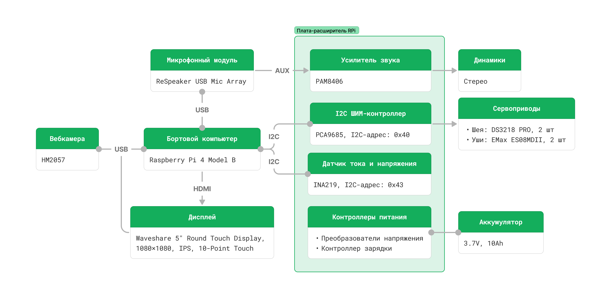
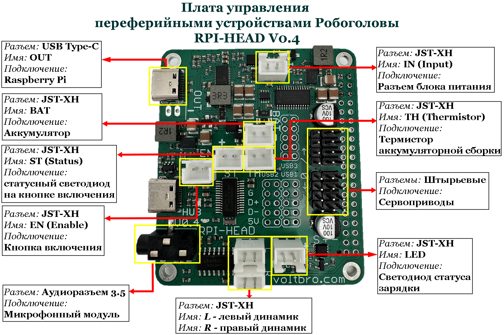

**Робоголова** Bbrain 1.0 построена на модульной архитектуре с открытыми интерфейсами, что позволяет легко модернизировать компоненты.

## Основные компоненты

- **Бортовой компьютер:** [Raspberry Pi 4 Model B](https://www.raspberrypi.com), 4 ГБ ОЗУ
- **Микрофонный массив:** [ReSpeaker USB Mic Array](https://wiki.seeedstudio.com/ReSpeaker-USB-Mic-Array/)
- **Дисплей:** Круглый сенсорный дисплей [Waveshare 5”, 1080×1080, IPS, HDMI, 10-точечный мультитач](https://www.waveshare.com/5inch-1080x1080-lcd.htm)
- **Камера:** [HM2057](https://aliexpress.ru/item/1005007851850685.html?ysclid=mafnt76ot3711286221&sku_id=1200004254025260), 2 МП, угол обзора 60°
- **Аккумулятор:** 2× Li-Ion 18650, 3.7 В
- **Управление «ушами»:** сервоприводы EMax ES08MDII
- **Управление «шеей»:** 2 степени свободы, сервоприводы Dsservo DS3218 PRO 20
- **Динамики:** 2× стереодинамика
- **Питание и интерфейсы:**
    - [PCA9685](https://cdn-shop.adafruit.com/datasheets/PCA9685.pdf) - 16-канальный ШИМ-контроллер (I2C), управление сервоприводами
    - [INA219](https://static.chipdip.ru/lib/766/DOC004766634.pdf) - датчик тока и напряжения аккумуляторов (I2C)
    - [PAM8406](https://www.diodes.com/assets/Datasheets/PAM8406.pdf) - стереоусилитель класса D
    - Понижающие преобразователи питания
    - Контроллер зарядки и защиты аккумуляторов
- **Связь:** Wi‑Fi 2.4/5 ГГц
- **Разъем для зарядки и работы от сети:** USB-Type C
- **Карта памяти:** microSD 16 Гб
- **Индикатор зарядки**

### Схема платы управления переферийными устройствами Робоголовы - RPI-HEAD V0.4

