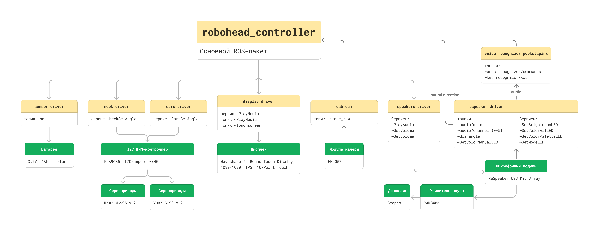
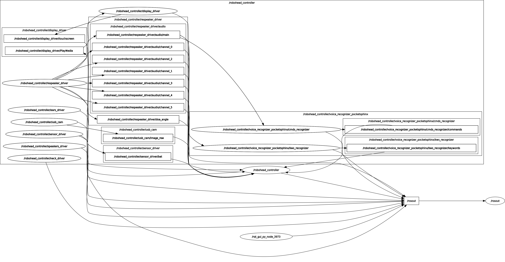

Робоголова Bbrain работает на полноценной ROS-архитектуре, обеспечивающей согласованное взаимодействие всех компонентов. Программная платформа построена по модульному принципу, где каждый аппаратный компонент управляется отдельным ROS-пакетом.

## Базовая программная среда

- **Операционная система:** Ubuntu Server 24.04.3 LTS (оптимизированная для Raspberry Pi 5)  
- **Middleware:** ROS Noetic Ninjemys  
- **Языки программирования:**  
  - _Python_ (основной)  
  - _C++_ (для ресурсоемких задач)

## Структура ROS-пакетов

:::note
**Важно** Все представленные ниже ROS-пакеты по умолчанию запускаются центральным пакетом `robohead_controller`. Если вам необходимо протестировать какую-либо аппаратную часть отдельно, перейдите в раздел **Режим отладки** каждого пакета.
:::

Центральную роль играет пакет `robohead_controller`, который координирует работу всех подсистем через систему ROS-топиков и сервисов. Основные функциональные пакеты:

1. **Управление аппаратными компонентами (драйвера)**  
   - `display_driver` — вывод графики на круглый дисплей и работа с тачскрином  
   - `ears_driver` — контроль сервоприводов «ушей»  
   - `neck_driver` — управление шейными сервоприводами  
   - `sensor_driver` — мониторинг состояния батареи  
   - `speakers_driver` — работа с аудиовыходом  
   - `usb_cam` — работа с видеопотоком
   - `respeaker_driver` — обработка звуковых данных с микрофонного массива 

2. **Обработка данных**  
   - `voice_recognizer_pocketsphinx` — распознавание голосовых команд из аудио-потока пакета `respeaker_driver`

3. **Интеграционные модули**  
   - `robohead_controller` — базовый пакет, осуществляющий слаженную работу драйверов
   - `turtlebro_controller` — взаимодействие с роботом TurtleBro
   - `mors_controller` — взаимодействие с робособакой МОРС

4. **Системные утилиты**  
   - `ru4sphinx` — утилита для конвертации списка фраз в словарь для распознавания **русской речи** в ROS-пакете `voice_recognizer_pocketsphinx`

## Визуализация топологии

Ниже приведена схема взаимодействия ROS-пакетов, отображаемая с помощью инструмента `rqt_graph`:

