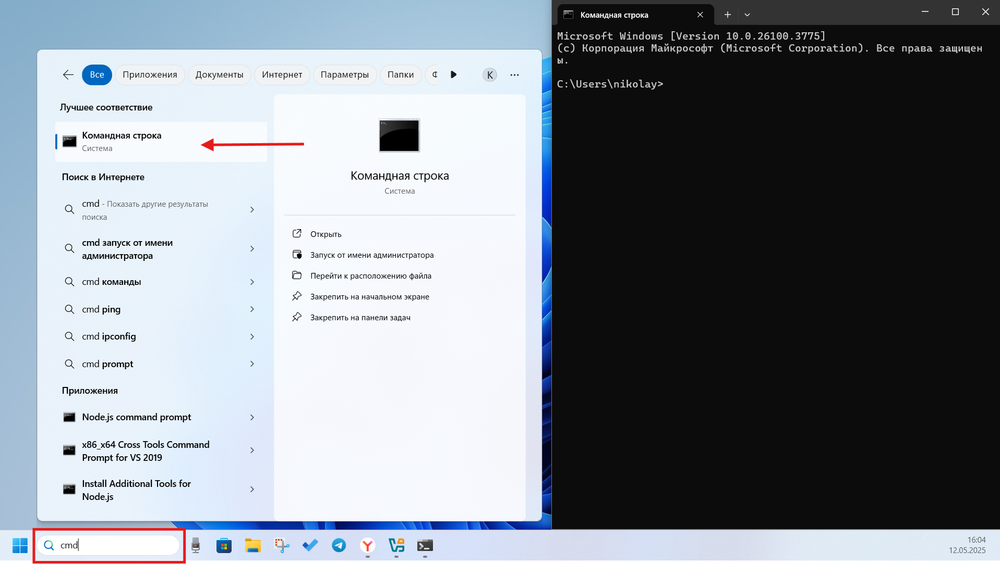

# Настройка ПО рабочего места

Для комфортной работы с устройством вам понадобится подготовить компьютер. Мы предлагаем три варианта настройки в зависимости от вашей операционной системы и уровня подготовки.

## Минимальная настройка для Windows

Если вы хотите начать работу с Робоголовой быстро:

1. **Установите Termius или PuTTY**  
   Необходимо для подключения к Робоголове по SSH. Также можно использовать встроенную в Windows командную строку. Для этого откройте командную строку и введите `cmd` и нажмите Enter:

2. **Установите Visual Studio Code**  
   Ссылка на официальный сайт: [Скачать VSCode](https://code.visualstudio.com/download)

---

## Альтернативный вариант: Windows с VirtualBox

Если вы хотите «окунуться» в мир Linux и ROS, но нет возможности установить Ubuntu отдельной операционной системой, то лучший вариант - установка программы для виртуализации VitrualBox :

1. **Установите и настройте VirtualBox**  
   - Скачайте образ ОС Ubuntu 24.04.3 LTS: [Ubuntu 24.04.3 LTS](https://releases.ubuntu.com/noble/)  
   - Скачайте програму VirtualBox: [VirtualBox Downloads](https://www.virtualbox.org/wiki/Downloads)  
   - Следуйте видео-руководству по установке и настройке: [Видео-руководство 1](https://vkvideo.ru/video-206862623_456239459)  
    

2. **Установите ROS2 Jazzy Jalisco**  
   - Следуйте инструкциям на официальном сайте: [ROS Jazzy Installation Guide](https://docs.ros.org/en/jazzy/Installation/Ubuntu-Install-Debs.html)

---

## Рекомендуемый вариант: отдельная операционная система Ubuntu 24.04 LTS

Лучший выбор для полноценной работы со всеми функциями ROS:

1. **Установите Ubuntu 24.04**  
   - Скачайте образ ОС с официального сайта: [Ubuntu 24.04.3 LTS](https://releases.ubuntu.com/noble/)   
   - Создайте загрузочную флешку (например, с помощью [Rufus](https://rufus.ie))

2. **Установите ROS Noetic Ninjemys**  

   - Следуйте инструкциям на официальном сайте: [ROS Jazzy Installation Guide](https://docs.ros.org/en/jazzy/Installation/Ubuntu-Install-Debs.html)

3. **Установите дополнительные программы**  
   - VSCode - для удобной работы с кодом  
   - Terminator - для удобной работы с терминалом

---

## Что выбрать?

- **Для быстрого старта** — Windows с базовыми программами  
- **Для тестирования и обучения** — VirtualBox с Ubuntu  
- **Для разработки и полноценной работы** — Ubuntu 24.04

> _Совет:_ Если вы планируете серьёзно работать с ROS, мы настоятельно рекомендуем установить Ubuntu как основную операционную систему.
