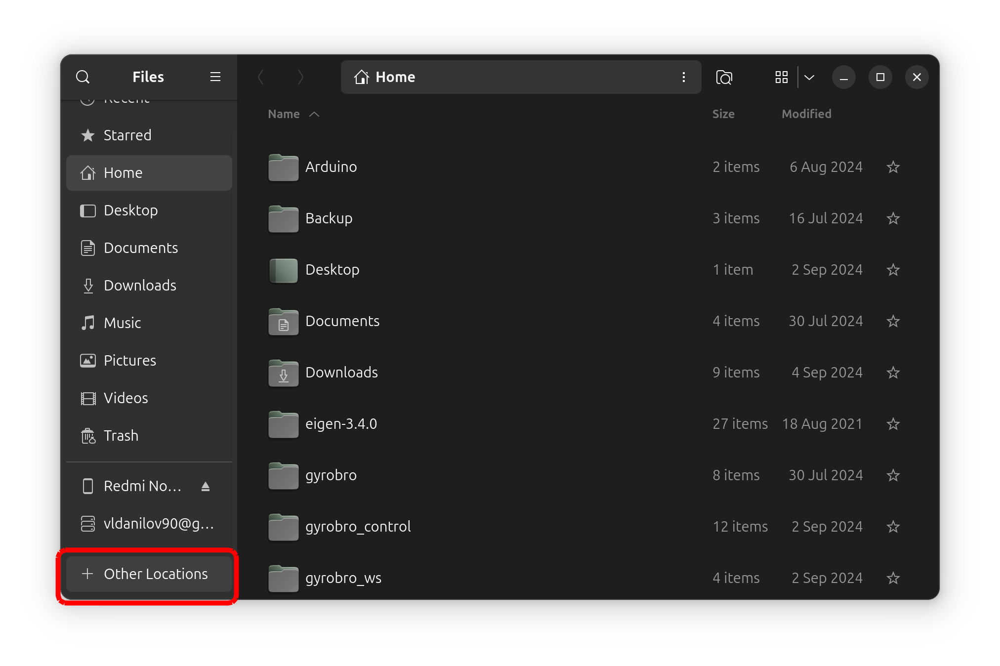
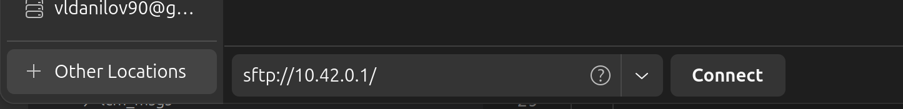

# Ubuntu

1. Откройте файловый менеджер **Nautilus**. Для этого нажмите кнопку Show Apps в левом нижнем углу и в строке поиска введите *Files*


2. В открывшемся окне в меню слева нажмите на кнопку **Other Locations**



3. В поле **Enter server address...** введите:
   ```
   sftp://<IP-адрес Робоголовы>
   ```
   и нажмите **Connect**



4. При первом подключении появится окно **Authentication Required**:
   - Введите **имя пользователя** и **пароль**.
   - Выберите один из вариантов:
     - *Forget password* - забыть пароль
     - *Remember password for this session* - запомнить пароль на текущую сессию
     - *Always remember password* -  запомнить навсегда
   - Нажмите **Connect**

---

# Windows

1. Скачайте и установите [**FileZilla**](https://filezilla.ru)

2. Откройте FileZilla и выберите **Файл → Менеджер Сайтов**

3. В **Менеджере Сайтов** нажмите **Новый сайт**

4. Настройте подключение:
   | Параметр   | Значение                   |
   |------------|----------------------------|
   | Протокол   | SFTP                       |
   | Хост       | `<IP-адрес Робоголовы>`    |
   | Пользователь | `pi`                      |
   | Пароль     | `brobro`                   |

5. Нажмите **Соединиться**
