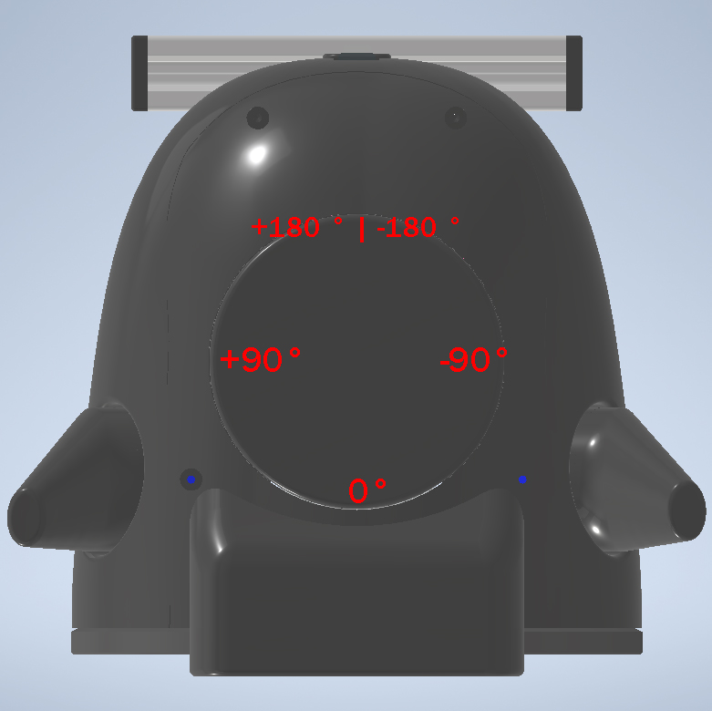

# Пакет `respeaker_driver`

**Назначение:** Пакет `respeaker_driver` обеспечивает взаимодействие с микрофонным массивом [ReSpeaker USB Mic Array](https://wiki.seeedstudio.com/ReSpeaker-USB-Mic-Array/), включая:

* фильтрацию шумов и эхоподавление
* подавление звуков, проигрываемых устройством (аппаратный эхо-миксер)
* определение направления источника звука (direction of arrival (doa))
* управление встроенными светодиодами (pixel ring)
---

## Содержание пакета

```text
respeaker_driver/
├── CMakeLists.txt
├── package.xml
├── setup.py
├── launch/
│   └── respeaker_driver.launch
├── config/
│   └── respeaker_driver.yaml
├── scripts/
│   └── main.py
│   └── respeaker_driver_dependencies/
│     └── pixel_ring.py
│     └── utils.py
└── examples/
    └── example_recording.py
```

---

## Запуск пакета

- Пакет `respeaker_driver` запускается автоматически при старте устройства.
- Запуск инициируется через launch-файл `robohead_controller_py.launch` из пакета `robohead_controller`.

---

## Основные возможности

**Доступные ROS-топики**

* **`/robohead_controller/respeaker_driver/audio/channel_0`**
  **Тип:** `audio_common_msgs/AudioData`
  Аппаратно-обработанный звук с микрофонного модуля.

* **`/robohead_controller/respeaker_driver/audio/channel_1`**
  **Тип:** `audio_common_msgs/AudioData`
  Звук с микрофона №1 микрофонного модуля.

* **`/robohead_controller/respeaker_driver/audio/channel_2`**
  **Тип:** `audio_common_msgs/AudioData`
  Звук с микрофона №2 микрофонного модуля.

* **`/robohead_controller/respeaker_driver/audio/channel_3`**
  **Тип:** `audio_common_msgs/AudioData`
  Звук с микрофона №3 микрофонного модуля.

* **`/robohead_controller/respeaker_driver/audio/channel_4`**
  **Тип:** `audio_common_msgs/AudioData`
  Звук с микрофона №4 микрофонного модуля.

* **`/robohead_controller/respeaker_driver/audio/channel_5`**
  **Тип:** `audio_common_msgs/AudioData`
  Звук, подающийся на воспроизведение через динамики.

* **`/robohead_controller/respeaker_driver/audio/main`**
  **Тип:** `audio_common_msgs/AudioData`
  Главный аудиоканал для программной обработки (например, распознавания команд). Дублирует один из каналов 0–5 (по умолчанию канал 0).

* **`/robohead_controller/respeaker_driver/doa_angle`**
  **Тип:** `std_msgs/Int16`
  Угол поступления звука в градусах (от -180 до 180).
  *(DOA — Direction of Arrival)*. Красный светодиод (по-умолчанию) на светодиодном кольце указывает направление.

* **`/robohead_controller/respeaker_driver/SetColorManualLED`**
  **Тип:** `std_msgs/ColorRGBA[12]`
  Топик для установки цвета каждого светодиода в отдельности. 

2. **Доступные ROS-сервисы**

* **`/robohead_controller/respeaker_driver/SetBrightnessLED`**
  **Тип:** `audio_common_msgs/AudioData`
  Сервис для установки яркости всей подсветки.

* **`/robohead_controller/respeaker_driver/SetColorAllLED`**
  **Тип:** `audio_common_msgs/AudioData`
  Сервис для установки одинакового цвета на всю подсветку.

* **`/robohead_controller/respeaker_driver/SetColorPaletteLED`**
  **Тип:** `audio_common_msgs/AudioData`
  Сервис для задачи цвета следяющего светодиода и цвета остальных светодиодов (устанавливает палитру для предустановленных режимов работы).

* **`/robohead_controller/respeaker_driver/SetModeLED`**
  **Тип:** `audio_common_msgs/AudioData`
  Сервис для переключения режимов работы светодиодного кольца.



2. **Управление светодиодным кольцом (Pixel Ring)**

   Подробнее об управлении подсветкой микрофонного модуля: [->](../30-setting-up-device/35-microphone-backlight-control.md)

## Режим отладки

В режиме отладки пакет `respeaker_driver` запускается изолированно (отдельно) для тестирования функций, без участия других компонентов системы.

### Шаг 1. Остановка всех запущенных пакетов

Остановите фоновый Linux-сервис:

```bash
sudo systemctl stop robohead.service
```

---

### Шаг 2. Запуск пакета вручную
Запустите пакет отдельно через launch-файл:
```bash
roslaunch respeaker_driver respeaker_driver.launch
```

---

### Шаг 3. Особенности работы в режиме отладки
- **Пространство имен**: топики и сервисы пакета **не имеет приставки** `/robohead_controller/`. Используется `/respeaker_driver/...` вместо `/robohead_controller/respeaker_driver/...`

- **Файл конфигурации**: настройки берутся из `respeaker_driver/config/respeaker_driver.yaml` вместо `robohead_controller/config/respeaker_driver.yaml`

---

### Шаг 4. Возможности тестирования

#### Определения направления звука (DOA)

- **Топик**: `/respeaker_driver/doa_angle` (тип сообщения: `std_msgs/Int16`)

**Пример:**

```bash
# Запустите в отдельном терминале
rostopic echo /respeaker_driver/doa_angle 
```
:::note
Во время вывода содержимого топика попробуйте щёлкать пальцами с разных сторон.
:::

#### Пример работы с топиками аудио на Python

Пример для записи звуков из топиков в .wav файл (убедитесь, что пакет запущен в режиме отладки):

```bash
# Запустите в отдельном терминале
rosrun respeaker_driver example_recording.py
```

:::note
После записи в терминале будут выведены пути до сохраненных файлов.
:::
