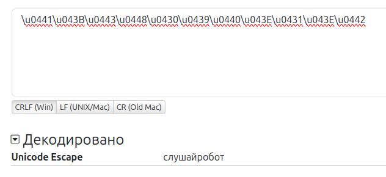

# Пакет `voice_recognizer_pocketsphinx`

**Назначение:** Пакет `voice_recognizer_pocketsphinx` занимается распознаванием команд из потокового аудио сигнала, публикуемого в топик `/robohead_controller/respeaker_driver/audio/main` пакетом [respeaker_driver](46-respeaker-driver.md).

В качестве внутреннего движка распознавания речи используется **pocketsphinx**.

---

## Содержание пакета

```text
voice_recognizer_pocketsphinx/
├── CMakeLists.txt
├── package.xml
├── launch/
│   └── cmds_recognizer.launch
│   └── kws_recognizer.launch
│   └── voice_recognizer_pocketsphinx.launch
├── config/
│ └── dictionary.dict
│ └── dictionary.dict.accent
│ └── dictionary.txt
│ └── gram.txt
│ └── gram.txt.fsg
│ └── kwslist.txt
│ └── voice_recognizer_pocketsphinx_cmds.yaml
│ └── voice_recognizer_pocketsphinx_kws.yaml
├── scripts/
│   └── cmds_recognizer.py
│   └── kws_recognizer.py
└── srv/
    └── IsWork.srv
```

---

## Запуск пакета

- Пакет `voice_recognizer_pocketsphinxr` запускается автоматически при старте устройства.
- Запуск инициируется через launch-файл `robohead_controller_py.launch` из пакета `robohead_controller`.

---

## Основные возможности {#ros-node-voice-pocketspinx}

Пакет `voice_recognizer_pocketsphinx` обеспечивает два режима распознавания на основе движка Pocketsphinx:

1. **Распознование ключевых слов (KWS — Keyword Spotting)** 

   * **Топик:** `/robohead_controller/voice_recognizer_pocketsphinx/kws_recognizer/keywords`
   * Отслеживает ключевые слова из файла `config/kwslist.txt`.
   * Публикует распознаный текст.

    *Подробнее про смену ключевой фразы:* [->](../30-setting-up-device/50-changing-keywords.md)

2. **Распознавание команд (CMDS — Command Spotting)**

   * **Топик:** `/robohead_controller/voice_recognizer_pocketsphinx/cmds_recognizer/commands`
   * Использует грамматику FSG из `config/gram.txt.fsg` для распознавания команд («Поздоровайся», «Покажи уши» и т.д.).
   * Публикует распознанную команду.

3. **Динамическая настройка словаря и грамматики**

   * Поддерживает возможность обновления файла `dictionary.txt` и `dictionary.dict.accent` для добавления новых слов и команд.
   * **Инструкция по генерации:** [Настройка собственных команд и ключевых слов](../40-working-with-device/20-adding-new-action.md)

4. **Управление состоянием работы**

   * **Сервисы:** 
   `/robohead_controller/voice_recognizer_pocketsphinx/kws_recognizer/IsWork`

      `/robohead_controller/voice_recognizer_pocketsphinx/cmds_recognizer/IsWork`
   
   * **Пример использования**:
   ```bash
   rosservice call /robohead_controller/voice_recognizer_pocketsphinx/cmds_recognizer/IsWork "SetStatus: 0" 
   ```
   
   * SetStatus - режим распознавания: 0 - остановить распознавание, 1 - возобновить распознавание. При передаче любого отличного от 0 и 1 значения вызов просто игнорируется

   * Возвращаемое значение: предыдущий статус распознавания (для получения текущего статуса распознавания без его изменения просто вызовите сервис с любым отличным от 0 и 1 значением)

---

## Режим отладки

В режиме отладки пакет `voice_recognizer_pocketsphinx` запускается изолированно (отдельно) для тестирования функций, без участия других компонентов системы.

### Шаг 1. Остановка всех запущенных пакетов

Остановите фоновый Linux-сервис:

```bash
sudo systemctl stop robohead.service
```

---

### Шаг 2. Запуск пакета вручную

Для того чтобы пакет `voice_recognizer_pocketsphinx` смог получать голосовую информацию необходимо сначала запустить пакет `respeaker_driver`:
```bash
roslaunch respeaker_driver respeaker_driver.launch
```

Затем в новом терминале запустите пакет `voice_recognizer_pocketsphinx` через launch-файл:
```bash
roslaunch voice_recognizer_pocketsphinx voice_recognizer_pocketsphinx.launch 
```

:::note
Если вывод закончился на "wait for topic /respeaker_driver/audio/main", то **убедитесь**, что пакет [respeaker_driver](46-respeaker-driver.md) запущен в режиме отладки
:::

---

### Шаг 3. Особенности работы в режиме отладки
- **Пространство имен**: топики и сервисы пакета **не имеет приставки** `/robohead_controller/`. Используется `/voice_recognizer_pocketsphinx/...` вместо `/robohead_controller/voice_recognizer_pocketsphinx/...`

- **Файл конфигурации**: настройки берутся из `voice_recognizer_pocketsphinx/config/voice_recognizer_pocketsphinx... .yaml` вместо `robohead_controller/config/voice_recognizer_pocketsphinx/voice_recognizer_pocketsphinx... .yaml`

---

### Шаг 4. Возможности тестирования

#### Распознование ключевых слов (KWS — Keyword Spotting)

> Ключевое слово по умолчанию "Слушай, Робот!"

- **Топик:** `/voice_recognizer_pocketsphinx/kws_recognizer/keywords`

**Пример:**

```bash
# Запустите в отдельном терминале
rostopic echo /voice_recognizer_pocketsphinx/kws_recognizer/keywords
```

#### Распознавание команд (CMDS — Command Spotting)

> Распознавание команд происходит исходя из словаря `voice_recognizer_pocketsphinx/config/dictionary.txt`. *Подробнее про добавление новых слов и команд:* [->]

- **Топик:** `/voice_recognizer_pocketsphinx/cmds_recognizer/commands`

**Пример:**

```bash
# Запустите в отдельном терминале
rostopic echo /voice_recognizer_pocketsphinx/cmds_recognizer/commands
```
#### Расшифровка полученных данных

Символы кириллицы обычно приходят в формате *unicode escape sequence*. Для отладки и прочтения используйте любой онлайн-конвертер:

[https://r12a.github.io/app-conversion/](https://r12a.github.io/app-conversion/)

[https://dencode.com/ru/string/unicode-escape](https://dencode.com/ru/string/unicode-escape)



