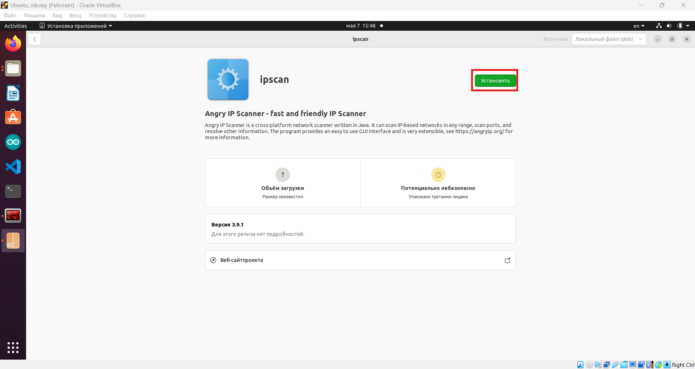
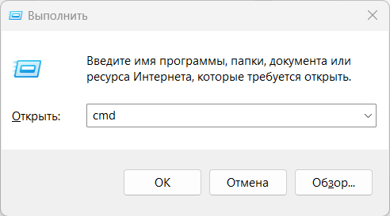
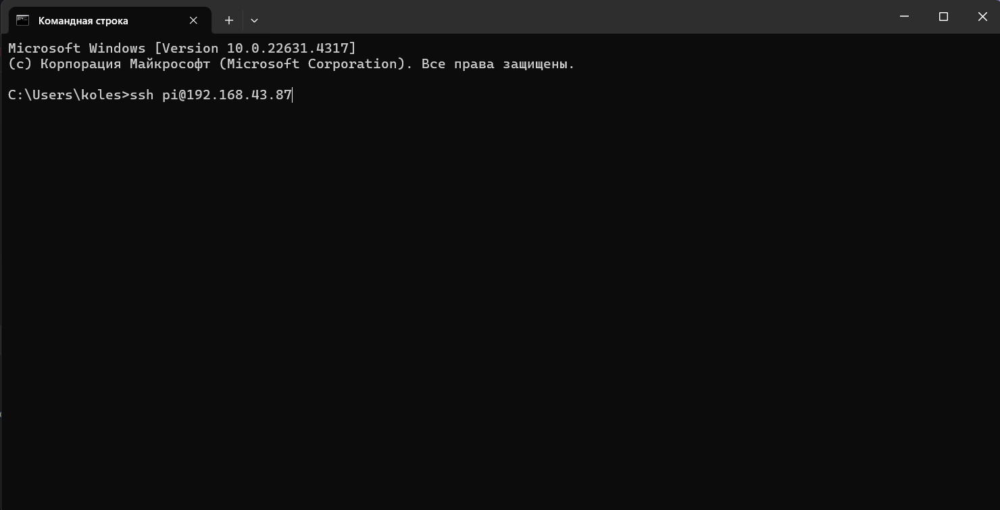
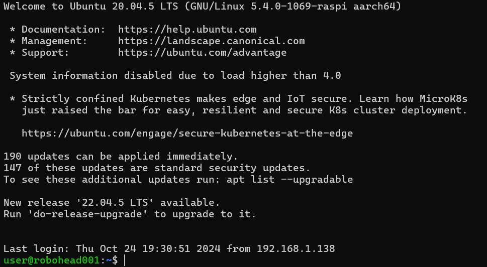

# Подключение по сетевому имени в локальной сети

По умолчанию на Raspberry Pi Робоголовы запущен SSH-сервис.

:::tip
Значения по умолчанию:
- **Логин:** `pi`  
- **Пароль:** `brobro`
:::
---

Для подключения вам необходимо [Настроить сеть](../30-setting-up-device/10-setting-up-Wi-Fi-connection.md)

Каждый робот имеет уникальное имя вида `roboheadXXX.local`, где `XXX` — это номер устройства. При правильной настройке сети и вашего роутера, вы сможете сразу подключиться к Raspberry по его сетевому имени в локальной сети:

```bash
ssh pi@roboheadXXX.local
```

:::note
Если подключение через `.local` не происходит, используйте IP-адрес устройства.
:::

---

# Подключение по IP-адресу

## Определение IP-адреса Робоголовы

1. **Через веб-интерфейс роутера**  
   - Откройте браузер и перейдите в интерфейс управления вашим роутером (обычно `192.168.1.1`, может отличаться).  
   - Авторизуйтесь и найдите раздел **"Список клиентов"** или **"Подключенные устройства"**.  
   - Найдите устройство с именем `roboheadNNN` и запомните его IP-адрес.

    На примере Keenetic Hopper:

- Заходим на страницу авторизации и вводим логин и пароль с доступом к веб-интерфейсу


- Переходим в раздел **Мои сети и Wi-Fi -> Список клиентов**


- Смотрим список устройств. Находим Робоголову и её IP-адрес


2. **С помощью программы Angry IP Scanner**

### Установка Angry IP Scanner

   #### Установка через bash-скрипт (Ubuntu)
   1. Скачайте универсальный установочный bash-скрипт:

   [https://disk.yandex.ru/d/lzFe95fTOM_ccA](https://disk.yandex.ru/d/lzFe95fTOM_ccA)

   2. Запустите его в терминале командой:
   
   ```bash
   sudo ./install_ipscan.sh
   ```
   3. После выполнения bash-скрипта появится ярлык приложения **Angry IP Scanner**

   

   #### 2. Установка через DEB-пакет (Ubuntu)
   1. Скачайте **x86 64-bit DEB Package for Ubuntu** с официального сайта: 

      [https://angryip.org/download/#linux ](https://angryip.org/download/#linux ) 
      
   2. Запустите скаченный файл и установите утилиту:



   3. После установки ярлык утилиты должен появится в списке приложений


### Определение с помощью Angry IP Scanner

   - Запустите **Angry IP Scanner**


   - Выберите необходимый диапазон сканируемых IP-адресов и запустите сканирование


   - После сканирования вы увидете статистику. Чтобы показывать только активные хосты, выберите в меню **Инструменты → Предпочтения ...→ Отобразить → Только активные хосты (отвечающие на пинг)**


   - Повторите сканирование. В случае, если компьютер и Робоголова подключены к одной Wi-FI сети, то вы должны увидеть IP-адрес Робоголовы:


---

## SSH-подключение по IP-адресу

В примерах используется IP-адрес `192.168.43.87`.

### Ubuntu


1. Откройте терминал и введите:

```bash
ssh pi@192.168.43.87
```
2. При первом подключении подтвердите ключ:
   ```text
   The authenticity of host '192.168.43.87 (192.168.43.87)' can't be established.
   ECDSA key fingerprint is SHA256:...
   Are you sure you want to continue connecting (yes/no/[fingerprint])?
   ```
   - Введите `yes` и нажмите **Enter**.  
2. Введите пароль `brobro` и нажмите **Enter**.  
3. После успешной аутентификации вы увидите:
   ```text
   Welcome to Ubuntu 20.04.6 LTS
   pi@roboheadNNN:~$
   ```

### Windows

Для доступа к роботу по SSH можно использовать встроенный терминал Windows. Для этого:

1. Нажмите **Win+R**, введите `cmd` и нажмите **OK**. 



2. В открывшемся терминале выполните:

```bash
ssh pi@192.168.43.87
```



3. Введите пароль `brobro`.  
4. После подключения появится приглашение `pi@roboheadXXX:~$`.



---

#### Полезные ссылки

| Ресурс                                     | Ссылка                                           |
|--------------------------------------------|--------------------------------------------------|
| Скрипт установки Angry IP Scanner          | [https://disk.yandex.ru/d/lzFe95fTOM_ccA](https://disk.yandex.ru/d/lzFe95fTOM_ccA)         |
| Официальный сайт Angry IP Scanner          | [https://angryip.org/download/#linux](https://angryip.org/download/#linux)            |
